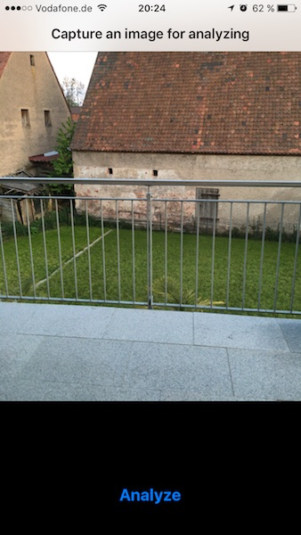
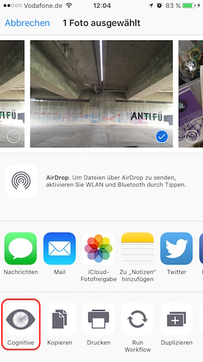
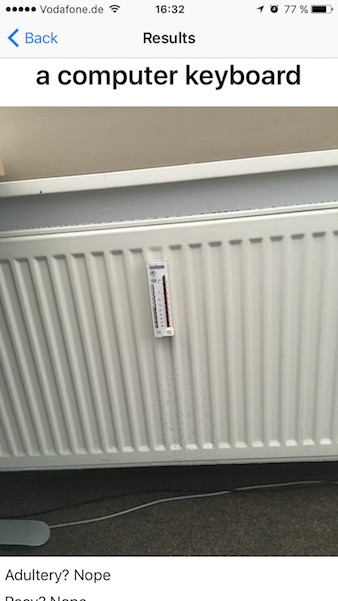
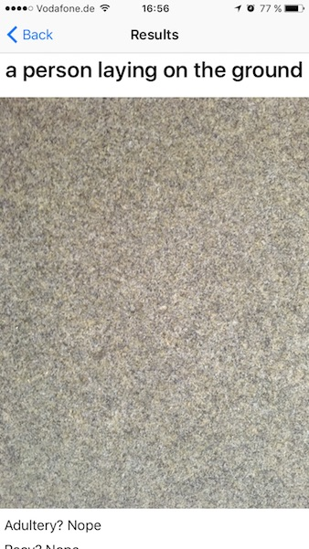

# Cognitive
This is a fun-project, intended to see what [Microsofts Cognitive Services (MCS)](https://www.microsoft.com/cognitive-services/) are capable of. I'm planning to integrate [Clarifai](https://www.clarifai.com/) to compare the quality of both services in everyday-life-scenarios - but don't count on it any time soon.

# Preconditions
- Register an account at [MCS](https://www.microsoft.com/cognitive-services/) (they provide free accounts without any hassle)
- Subscribe at least to the Computer Vision-, Emotion- and Face-Services
- Clone this repository
- Edit the 'SubscriptionKeys.swift'-file and add enter your subscription-keys
- Compile and start the app

# The App

The app itself has a camera-view to take a picture that will be directly analyzed. But it also provides an action-extension, so can you use it from any other app. 

App-UI		| Action-extension
:--------:|:-----------------:
 | 

Just remember that the images will be sent to Microsofts servers for any privacy concerns.

# Experiences with MCS
I really like the hassle-free-process of creating a free account with really generous limits (for example, the Computer-Vision-Services allows '5,000 transactions per month, 20 per minute'). The same is true for the API - it's simple and they provide minimalistic example-code for a variety of langauges.

Though, the actual results that they produce... well, they are often good for a lough, to be positive.

Not so much a computer-keyboard		| Not so much a person on the ground
:--------:|:-----------------:
 | 

You may want to take a look at this Twitter-account [this Twitter-account](https://twitter.com/picdescbot), which is a bot that tweets random selected images with their descriptions produces by MCS. The tags are often more useful, OCR works fine (in this app, the quality of the results is limited as I reduce the image-size before sending it to the services). I haven't collected enough experiences with the other services, though.

# Known Issues
- Receiving "Snapshotting a view that has not been rendered results in an empty snapshot. Ensure your view has been rendered at least once before snapshotting or snapshot after screen updates." on console when launching the app. This is caused by adding the UIImagePickerController as child-view-controller in viewDidLoad, which is probably not right. Eventually, UIImagePickerController should be replaced.
- On my iPhone 6s, scrolling the collection-view scatters. Haven't thought out why yet. Framerate in Instruments looks fine, a first look on profiling the CPU didn't show anything suspicious. It might be related to the rounded-corners of the CellForTags, but I would assume that an 6s should not be impressed by that.
- Small recognized texts may not fit into the height of the labels.
- Neither the orientation of images nor the text-angle is not taken into account when adding labels for recognized text.
- OCR fails more often than it should, probably because of the resizing of the images before they will be sent to the services.
- The rotation of recognized texts is not taken into account when placing the labels.